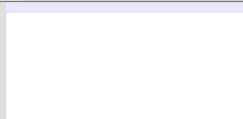

# How it works

Press and hold a letter that supports diacritic marks, then press space bar or arrow key to select the accent. For example <kbd>E</kbd> + <kbd>Space</kbd>. With spacebar, repeat presses to change accent mark. When releasing the letter key, the accented letter is inserted.

> Note: Some characters (like `¡` for Spanish are available with the comma (`,`) key).

The software is currently working with the most of accents for several (Latin script based) countries, including **Czech**, **German**, **France**, **Maori** and many others. The list can be found in [Languages.cs](/PowerAccent.Core/Languages.cs).
If any language is missing, don't hesitate to [create an issue][newissue].

All letters are sorted by usage frequency by default, as found on [Wikipedia](https://wikipedia.org/wiki/Letter_frequency).

# Download

See the [Releases][releases] page.

# Known problems

- Some keys can have interference with some actions or some tools (for example: AutoHotkey)
- (Experimental feature) Inside browsers and some other software, the tool can't detect the caret position. Default position is applied, meaning the one you choose in the position settings.
- Mathematical symbols are often requested. But for several reasons (technical and functional), this feature can't be implemented now in the tool. So currently mathematical symbol will not be accepted (cf: [issue](https://github.com/damienleroy/PowerAccent/issues/23#issuecomment-1301532208)).

# The future

- More letters and accents
- Theme and design improvement
- Some other [asked features][issues]

# PowerToys
PowerAccent has been implemented in [PowerToys](https://github.com/microsoft/PowerToys) and renamed as [QuickAccent](https://aka.ms/PowerToysOverview_QuickAccent). Both have globally the same features and offer different experiences in the usage (taskbar icon, and different settings view).

# If you like it

Buy me a coffee. ☕
https://www.buymeacoffee.com/dams

# Thanks to

- [Ciantic](https://gist.github.com/Ciantic/471698) for the implementation of the Keyboard Listener.
- [Saurabh Singh](https://www.codeproject.com/Articles/34520/Getting-Caret-Position-Inside-Any-Application) to share how get the caret position.
- [PowerToys team](https://github.com/microsoft/PowerToys) to integrated PowerAccent in PowerToys (named as Quick Accent).

[issues]: https://github.com/damienleroy/PowerAccent/issues
[newissue]: https://github.com/damienleroy/PowerAccent/issues/new
[releases]: https://github.com/damienleroy/PowerAccent/releases
